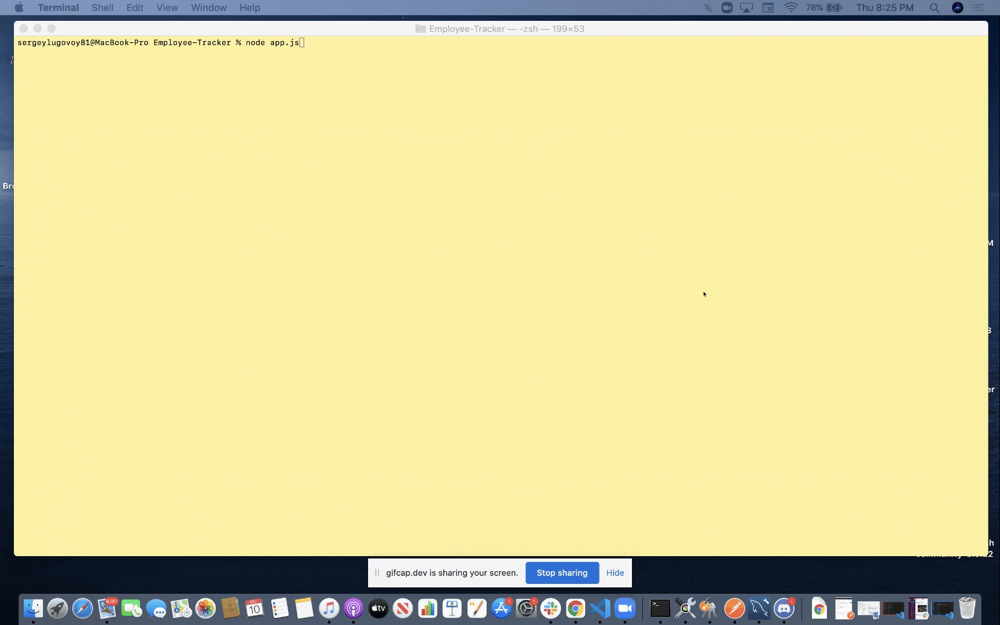

# Employee-Tracker

Employee Tracker is an application for building and maintaining companies employee data base. This application allows managers or someone within the company to view all employees, roles, as well as departments. It also allows for adding employees, roles, departments and updating employees.

Checkout the [Walkthrough Video here]().

## Table of Contents
* [Installation](#installation)
* [Usage](#usage)
* [Technologies](#technologies)
* [Contributing](#contributing)
* [License](#license)
* [Questions](#questions)

## Installation

To use this application you will need:
1. First run an `npm install` in your terminal to install the dependencies that have been loaded into the json files.
2. Run `node app.js` in your terminal to start the prompts that will walk you through the various tasks.

## Usage

* Gif:

* Instructions:

When you run `node app.js`, the app uses the `inquirer package` to ask you in the command line a questions about actions you want to perform.

You can choose to view all employees, view all roles, add roles, add departments, update employees and etc.

## Technologies

This application utilizes `promises`, `async/await`, `inquirer`, `node.js`, `MySQL`, `asciiart-logo`.

## Contributing

When contributing to this repository, please first discuss the change you wish to make via issue, email, or any other method with the owners of this repository before making a change.

### Steps for contributing
1. Fork it!
2. Create your feature branch: `git checkout -b my-new-feature`
3. Commit your changes: `git commit -am 'Add some feature'`
4. Push to the branch: `git push origin my-new-feature`
5. Submit a pull request.

## License

## Questions

If you have any questions or concerns, feel free to contact me via:

GitHub: [slugovoy](https://github.com/slugovoy)

Email: serg.lugovoy.81@gmail.com